```mermaid
graph TB
%% Top to Bottom layout

    %% External Systems & Data Stores (Typically at the very top or bottom, or to the sides)
    subgraph "External Systems & Data Stores"
        direction LR
        User["User (Developer)"]
        InputFile["Input: Issue File"]
        ConfigFile["Input: config.yaml"]
        GitHubSetupDefaultsFile["Input: github_setup_defaults.yml"]
        EnvVars["Input: Environment Variables"]
        GitHubAPI["External: GitHub API"]
        AIServiceAPI["External: AI Service API"]
        LocalFileSystem["External: Local File System"]
    end

    %% Presentation Layer (Top Layer)
    subgraph "Presentation Layer"
        direction LR
        WebUI["Web UI (Django App)"]
        CLI["CLI (Typer)"]
    end

    %% Application Service Layer (Optional, between Presentation and Use Cases)
    subgraph "Application Service Layer (検討中)"
        direction LR
        DjangoAppService["Django App Service Layer"]
    end

    %% Core Logic - Use Cases Layer
    subgraph "Core Logic - Use Cases (core_logic.use_cases)"
        direction LR
        AIParseFileUC["AIParseFileUseCase (Orchestrator)"]
        CreateGitHubResourcesUC["CreateGitHubResourcesUseCase"]
        LocalSaveUC["LocalSaveUseCase (構想)"]
        %% Sub-usecases are called by their parent usecase, so not directly exposed to AppService usually
        %% CreateIssuesUC["CreateIssuesUC"]
        %% CreateRepositoryUC["CreateRepositoryUC"]
    end

    %% Core Logic - Adapters & Core Services Layer (Interfaces for external systems and core functionalities)
    %% This layer uses Domain Models and Infrastructure, and is used by Use Cases
    subgraph "Core Logic - Adapters & Core Services (core_logic.adapters & core_logic.services)"
        direction LR
        AIRuleInferenceEngineAdp["AI Rule Inference Engine"]
        RuleBasedSplitterSvc["Rule-based Splitter"]
        RuleBasedMapperSvc["Rule-based Mapper"]
        LabelMilestoneNormalizerSvc["Label/Milestone Normalizer"]
        InitialFileParserAdp["Initial File Parser"]
        GitHubRestClientAdp["GitHub REST Client"]
        GitHubGraphQLClientAdp["GitHub GraphQL Client"]
        AssigneeValidatorAdp["Assignee Validator"]
        CliReporterAdp["CLI Reporter"]
        LocalFileSaverAdp["Local File Saver"]
    end

    %% Core Logic - Domain Models Layer (Center of Clean Architecture)
    subgraph "Core Logic - Domain Models (core_logic.domain.models)"
        direction LR
        IssueDataMdl["IssueData"]
        ParsedSourceFileContentMdl["ParsedSourceFileContent"]
        AISuggestedRulesMdl["AISuggestedRules"]
        CreateIssuesResultMdl["CreateIssuesResult"]
        CreateGitHubResourcesResultMdl["CreateGitHubResourcesResult"]
        LocalFileSplitResultMdl["LocalFileSplitResult"]
    end

    %% Infrastructure Layer (Lowest Layer, details external to Core Logic)
    subgraph "Infrastructure Layer (core_logic.infrastructure)"
        direction LR
        ConfigLoaderInfra["Config Loader (config.py)"]
        DefaultsLoaderInfra["Defaults Loader (github_setup_defaults.yml)"]
        FileReaderInfra["File Reader (file_reader.py)"]
    end

    %% Dependencies (Arrows generally point downwards, or towards the center for Domain Models)

    %% User interaction with Presentation Layer
    User -- "Interacts via" --> WebUI
    User -- "Interacts via" --> CLI

    %% Presentation Layer uses Application Service Layer (or Use Cases directly if no AppService)
    WebUI --> DjangoAppService
    CLI -- "directly calls" --> AIParseFileUC
    CLI -- "directly calls" --> CreateGitHubResourcesUC
    CLI -- "directly calls" --> LocalSaveUC

    %% Application Service Layer uses Use Cases
    DjangoAppService -- "calls" --> AIParseFileUC
    DjangoAppService -- "calls" --> CreateGitHubResourcesUC
    DjangoAppService -- "calls" --> LocalSaveUC

    %% Use Cases use Adapters/Services and Domain Models
    AIParseFileUC -- "orchestrates" --> AIRuleInferenceEngineAdp
    AIParseFileUC -- "orchestrates" --> RuleBasedSplitterSvc
    AIParseFileUC -- "orchestrates" --> RuleBasedMapperSvc
    AIParseFileUC -- "orchestrates" --> LabelMilestoneNormalizerSvc
    AIParseFileUC -- "uses (preprocessing/fallback)" --> InitialFileParserAdp
    AIParseFileUC -- "produces/uses" --> ParsedSourceFileContentMdl
    AIParseFileUC -- "uses" --> AISuggestedRulesMdl
    %% AI Engine produces, UC consumes/passes

    CreateGitHubResourcesUC -- "uses" --> GitHubRestClientAdp
    CreateGitHubResourcesUC -- "uses" --> GitHubGraphQLClientAdp
    CreateGitHubResourcesUC -- "uses" --> AssigneeValidatorAdp
    CreateGitHubResourcesUC -- "consumes" --> ParsedSourceFileContentMdl
    CreateGitHubResourcesUC -- "produces" --> CreateGitHubResourcesResultMdl
    %% CreateGitHubResourcesUC calls sub-usecases CreateIssuesUC & CreateRepositoryUC (internal to UC layer)

    LocalSaveUC -- "uses" --> LocalFileSaverAdp
    LocalSaveUC -- "consumes" --> ParsedSourceFileContentMdl
    LocalSaveUC -- "produces" --> LocalFileSplitResultMdl

    %% Adapters/Services use Infrastructure and External Systems, and interact with Domain Models
    AIRuleInferenceEngineAdp -- "communicates with" --> AIServiceAPI
    AIRuleInferenceEngineAdp -- "uses prompt config from" --> ConfigLoaderInfra
    AIRuleInferenceEngineAdp -- "produces" --> AISuggestedRulesMdl

    RuleBasedSplitterSvc -- "uses delimiter rules from" --> AISuggestedRulesMdl
    RuleBasedSplitterSvc -- "uses fallback rules from" --> ConfigLoaderInfra
    RuleBasedSplitterSvc -- "processes data from" --> FileReaderInfra

    RuleBasedMapperSvc -- "uses key mapping rules from" --> AISuggestedRulesMdl
    RuleBasedMapperSvc -- "processes blocks from" --> RuleBasedSplitterSvc
    RuleBasedMapperSvc -- "populates" --> IssueDataMdl

    LabelMilestoneNormalizerSvc -- "uses definitions from" --> DefaultsLoaderInfra
    LabelMilestoneNormalizerSvc -- "normalizes data in" --> IssueDataMdl

    InitialFileParserAdp -- "reads via" --> FileReaderInfra

    GitHubRestClientAdp -- "communicates with" --> GitHubAPI
    GitHubGraphQLClientAdp -- "communicates with" --> GitHubAPI
    AssigneeValidatorAdp -- "uses" --> GitHubRestClientAdp
    CliReporterAdp -- "outputs for" --> CLI
    %% Output for user, initiated by CLI
    LocalFileSaverAdp -- "writes to" --> LocalFileSystem

    %% Infrastructure Layer interacts with External Data Stores (Files)
    ConfigLoaderInfra -- "reads" --> ConfigFile
    ConfigLoaderInfra -- "reads" --> EnvVars
    DefaultsLoaderInfra -- "reads" --> GitHubSetupDefaultsFile
    FileReaderInfra -- "reads" --> InputFile

    %% Domain Models are used by Use Cases and Adapters/Services
    %% (Implicitly used, direct arrows can make it too cluttered)

    classDef user fill:#E6E6FA,stroke:#333,stroke-width:2px;
    classDef external fill:#ADD8E6,stroke:#333,stroke-width:2px;
    classDef presentation fill:#90EE90,stroke:#333,stroke-width:2px;
    classDef app_service fill:#FFFFE0,stroke:#333,stroke-width:2px;
    classDef core_logic_main fill:#FFDAB9,stroke:#333,stroke-width:2px;
    %% Not used for subgraphs directly 
    classDef use_case fill:#FFC0CB,stroke:#333,stroke-width:1px,text-align:center;
    classDef domain_model fill:#B0E0E6,stroke:#333,stroke-width:1px,text-align:center;
    classDef adapter_service fill:#F0E68C,stroke:#333,stroke-width:1px,text-align:center;
    classDef infra fill:#D3D3D3,stroke:#333,stroke-width:2px,text-align:center;

    class User user;
    class InputFile,ConfigFile,GitHubSetupDefaultsFile,EnvVars,GitHubAPI,AIServiceAPI,LocalFileSystem external;
    class WebUI,CLI presentation;
    class DjangoAppService app_service;
    class AIParseFileUC,CreateGitHubResourcesUC,LocalSaveUC use_case;
    class IssueDataMdl,ParsedSourceFileContentMdl,AISuggestedRulesMdl,CreateIssuesResultMdl,CreateGitHubResourcesResultMdl,LocalFileSplitResultMdl domain_model;
    class InitialFileParserAdp,AIRuleInferenceEngineAdp,RuleBasedSplitterSvc,RuleBasedMapperSvc,LabelMilestoneNormalizerSvc,GitHubRestClientAdp,GitHubGraphQLClientAdp,AssigneeValidatorAdp,CliReporterAdp,LocalFileSaverAdp adapter_service;
    class ConfigLoaderInfra,DefaultsLoaderInfra,FileReaderInfra infra;
```

**図の凡例と説明の更新:**

* **Core Logic (薄オレンジ):**
    * **Use Cases (ピンク):** アプリケーションの主要な業務フロー。`AIParseFileUseCase` を追加。
    * **Domain Models (水色):** ビジネスの概念とルールを表すデータ構造。`AISuggestedRulesMdl` を追加。
    * **Adapters & Core Services (黄土色):** 外部システムとの連携、データ形式変換、およびAIパーサー関連の中核的なサービスコンポーネント群。`InitialFileParserAdp` の説明を更新し、`AIRuleInferenceEngineAdp`, `RuleBasedSplitterSvc`, `RuleBasedMapperSvc`, `LabelMilestoneNormalizerSvc` を追加。
* **Infrastructure Layer (薄灰):** `DefaultsLoaderInfra` を追加。

**主な変更点:**

1.  **`AIParseFileUseCase` の導入:**
    * ファイル解析処理のオーケストレーションを担当するUseCaseとして `AIParseFileUseCase` を「Use Cases」サブグラフに明示的に配置しました。
    * Web UI (DjangoAppService経由) および CLI は、まずこの `AIParseFileUC` を呼び出して `ParsedSourceFileContentMdl` を取得する流れになります。
2.  **AIパーサー関連コンポーネントの具体化:**
    * 既存の `AIParserAdp` を、より具体的な責務を持つコンポーネント群に分割・名称変更しました。
        * `AIRuleInferenceEngineAdp`: AI Service APIと連携してルールを推論するアダプター。
        * `RuleBasedSplitterSvc`: 推論/設定された区切りルールに基づいてファイルを分割するサービス。
        * `RuleBasedMapperSvc`: 推論されたキーマッピングルールに基づいてマッピングするサービス。
        * `LabelMilestoneNormalizerSvc`: ラベルとマイルストーンを正規化するサービス。
    * `InitialFileParserAdp` の説明を「前処理・フォールバック区切りロジック提供検討」と更新し、役割の変化を反映しました。
3.  **ドメインモデルの追加:**
    * `AISuggestedRulesMdl`: AIが推論した区切りルールとキーマッピングルールを保持するドメインモデルを「Domain Models」サブグラフに追加しました。
4.  **設定ファイルとの連携明確化:**
    * `DefaultsLoaderInfra` を「Infrastructure Layer」に追加し、`GitHubSetupDefaultsFile` からラベル・マイルストーン定義を読み込む役割を示しました。
    * `ConfigLoaderInfra` の説明に「プロンプトパス、フォールバック区切り指定等」を追記し、AIパーサー戦略との関連を明確にしました。
5.  **連携の変更・詳細化:**
    * `AIParseFileUseCase` を中心としたファイル解析フローの連携を記述しました（FileReaderInfra → InitialFileParserAdp (オプション) → AIRuleInferenceEngineAdp → AISuggestedRulesMdl → RuleBasedSplitterSvc → RuleBasedMapperSvc → DefaultsLoaderInfra → LabelMilestoneNormalizerSvc → ParsedSourceFileContentMdl）。
    * `AIRuleInferenceEngineAdp` が `ConfigLoaderInfra` からプロンプト設定を、`RuleBasedSplitterSvc` が `ConfigLoaderInfra` からフォールバック区切りルール設定を、`LabelMilestoneNormalizerSvc` が `DefaultsLoaderInfra` からデフォルト定義を利用する関係を示しました。
    * `CreateGitHubResourcesUC` や `LocalSaveUC` は、`AIParseFileUC` によって生成された `ParsedSourceFileContentMdl` を入力として受け取る形になります。

この修正により、アーキテクチャ図がAIパーサーの新しい処理フローとコンポーネント構成をより正確に反映し、システム全体の理解を助けるものになったかと存じます。
