```mermaid
graph TD
    subgraph "Presentation Layer"
        WebUI["Web UI (Django App - app.views, app.forms, templates)"]
        CLI["CLI (Typer - core_logic.main)"]
    end

    subgraph "Application Service Layer (検討中)"
        DjangoAppService["Django App Service Layer (app.services - 新設案)"]
    end

    subgraph "Core Logic (github_automation_tool)"
        subgraph "Use Cases (core_logic.use_cases)"
            CreateGitHubResourcesUC["CreateGitHubResourcesUseCase"]
            CreateIssuesUC["CreateIssuesUseCase"]
            CreateRepositoryUC["CreateRepositoryUseCase"]
            LocalSaveUC["LocalSaveUseCase (構想)"]
        end

        subgraph "Domain Models (core_logic.domain.models)"
            IssueDataMdl["IssueData"]
            ParsedSourceFileContentMdl["ParsedSourceFileContent"]
            CreateIssuesResultMdl["CreateIssuesResult"]
            CreateGitHubResourcesResultMdl["CreateGitHubResourcesResult"]
            LocalFileSplitResultMdl["LocalFileSplitResult (構想)"]
        end

        subgraph "Adapters (core_logic.adapters)"
            InitialFileParsers["File Parsers (MD, YAML, JSON)"]
            AIParserAdp["AI Parser (LangChain, OpenAI/Gemini)"]
            GitHubRestClientAdp["GitHub REST Client"]
            GitHubGraphQLClientAdp["GitHub GraphQL Client"]
            AssigneeValidatorAdp["Assignee Validator"]
            CliReporterAdp["CLI Reporter"]
            LocalFileSaverAdp["Local File Saver (構想)"]
        end
    end

    subgraph "Infrastructure Layer (core_logic.infrastructure)"
        ConfigLoaderInfra["Config Loader (config.py)"]
        FileReaderInfra["File Reader (file_reader.py)"]
    end

    subgraph "External Systems & Data Stores"
        User["User (Developer)"]
        InputFile["Input: Issue File (MD, YAML, JSON)"]
        ConfigFile["Input: config.yaml"]
        EnvVars["Input: Environment Variables"]
        GitHubAPI["External: GitHub API"]
        AIServiceAPI["External: AI Service API (OpenAI/Gemini)"]
        LocalFileSystem["External: Local File System (for save)"]
    end

    %% Presentation Layer to Application Service Layer / Use Cases
    User -- "HTTP Requests (File Upload, Actions)" --> WebUI
    WebUI --> DjangoAppService
    DjangoAppService --> CreateGitHubResourcesUC
    DjangoAppService --> LocalSaveUC

    User -- "CLI Commands & Arguments" --> CLI
    CLI --> CreateGitHubResourcesUC
    CLI --> LocalSaveUC

    %% Use Cases to Domain Models & Adapters
    CreateGitHubResourcesUC --> CreateIssuesUC
    CreateGitHubResourcesUC --> CreateRepositoryUC
    CreateGitHubResourcesUC -- "uses" --> GitHubRestClientAdp
    CreateGitHubResourcesUC -- "uses" --> GitHubGraphQLClientAdp
    CreateGitHubResourcesUC -- "uses" --> AssigneeValidatorAdp
    CreateGitHubResourcesUC -- "processes" --> ParsedSourceFileContentMdl
    CreateGitHubResourcesUC -- "returns" --> CreateGitHubResourcesResultMdl

    CreateIssuesUC -- "uses" --> GitHubRestClientAdp
    CreateIssuesUC -- "uses" --> AssigneeValidatorAdp
    CreateIssuesUC -- "processes" --> ParsedSourceFileContentMdl
    CreateIssuesUC -- "returns" --> CreateIssuesResultMdl

    CreateRepositoryUC -- "uses" --> GitHubRestClientAdp

    LocalSaveUC -- "uses" --> LocalFileSaverAdp
    LocalSaveUC -- "processes" --> ParsedSourceFileContentMdl
    LocalSaveUC -- "returns" --> LocalFileSplitResultMdl

    %% Adapters interacting with External Systems or using Infrastructure
    InitialFileParsers -- "reads via" --> FileReaderInfra
    FileReaderInfra -- "reads" --> InputFile
    InitialFileParsers -- "produces raw blocks for" --> AIParserAdp

    AIParserAdp -- "uses" --> AIServiceAPI
    AIParserAdp -- "uses config from" --> ConfigLoaderInfra
    AIParserAdp -- "produces" --> ParsedSourceFileContentMdl

    GitHubRestClientAdp -- "communicates with" --> GitHubAPI
    GitHubRestClientAdp -- "uses config from" --> ConfigLoaderInfra
    GitHubGraphQLClientAdp -- "communicates with" --> GitHubAPI
    GitHubGraphQLClientAdp -- "uses config from" --> ConfigLoaderInfra
    AssigneeValidatorAdp -- "uses" --> GitHubRestClientAdp

    LocalFileSaverAdp -- "writes to" --> LocalFileSystem

    CliReporterAdp -- "outputs to console for" --> User

    %% Config Loader
    ConfigLoaderInfra -- "reads" --> ConfigFile
    ConfigLoaderInfra -- "reads" --> EnvVars


    classDef user fill:#E6E6FA,stroke:#333,stroke-width:2px;
    classDef external fill:#ADD8E6,stroke:#333,stroke-width:2px;
    classDef presentation fill:#90EE90,stroke:#333,stroke-width:2px;
    classDef app_service fill:#FFFFE0,stroke:#333,stroke-width:2px;
    classDef core_logic_main fill:#FFDAB9,stroke:#333,stroke-width:2px;
    classDef use_case fill:#FFC0CB,stroke:#333,stroke-width:1px;
    classDef domain_model fill:#B0E0E6,stroke:#333,stroke-width:1px;
    classDef adapter fill:#F0E68C,stroke:#333,stroke-width:1px;
    classDef infra fill:#D3D3D3,stroke:#333,stroke-width:2px;


    class User user;
    class InputFile,ConfigFile,EnvVars,GitHubAPI,AIServiceAPI,LocalFileSystem external;
    class WebUI,CLI presentation;
    class DjangoAppService app_service;
    class CreateGitHubResourcesUC,CreateIssuesUC,CreateRepositoryUC,LocalSaveUC use_case;
    class IssueDataMdl,ParsedSourceFileContentMdl,CreateIssuesResultMdl,CreateGitHubResourcesResultMdl,LocalFileSplitResultMdl domain_model;
    class InitialFileParsers,AIParserAdp,GitHubRestClientAdp,GitHubGraphQLClientAdp,AssigneeValidatorAdp,CliReporterAdp,LocalFileSaverAdp adapter;
    class ConfigLoaderInfra,FileReaderInfra infra;
```

**図の凡例と説明:**

* **Presentation Layer (薄緑):** ユーザーとの直接的な接点 (Web UI, CLI)。
* **Application Service Layer (薄黄 - 検討中):** Django Web UIとコアロジック間の調整役。
* **Core Logic (薄オレンジ):** システムの中核。
    * **Use Cases (ピンク):** アプリケーションの主要な業務フロー。
    * **Domain Models (水色):** ビジネスの概念とルールを表すデータ構造。
    * **Adapters (黄土色):** 外部システムとの連携やデータ形式変換。
* **Infrastructure Layer (薄灰):** 設定読み込みやファイルI/Oなど、低レベルな技術的処理。
* **External Systems & Data Stores (水色と薄紫):** システム外のエンティティ。

**主な連携:**

1.  **User** は **Web UI** または **CLI** を通じてシステムを操作します。
2.  **Web UI** は、導入されれば **Django App Service Layer** を経由して、**CLI** は直接 **Core Logic** の **Use Cases** を呼び出します。
3.  **Use Cases** は、処理に必要なデータを **Domain Models** として扱い、**Adapters** を通じて外部システム（**GitHub API**, **AI Service API**, **Local File System**）と連携したり、入力（**InputFile**）を処理したりします。
4.  **Adapters** や **Use Cases** は、**Infrastructure Layer** のコンポーネント（**Config Loader**, **FileReader**）を利用して設定情報やファイル内容を取得します。
