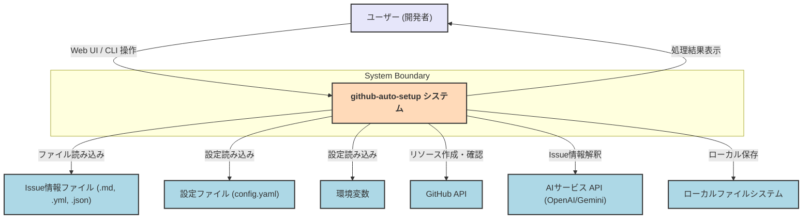

**図の説明:**

* **`github-auto-setup システム` (システム境界内 - 薄オレンジ):** これが開発対象のシステム全体を表します。内部のコンポーネント分割（Web UI, CLI, Core Logicなど）は、この図では意図的に詳細化せず、システムを一つのブラックボックスとして捉えています。
* **外部エンティティ (水色および薄紫):**
    * **`ユーザー (開発者)` (薄紫):** システムを操作する主体です。
    * **`Issue情報ファイル (.md, .yml, .json)`:** システムへの主要な入力データです。
    * **`設定ファイル (config.yaml)`:** システムの動作をカスタマイズするための外部設定ファイルです。
    * **`環境変数`:** 主に秘匿情報や実行環境依存の設定を提供します。
    * **`GitHub API`:** Issue、リポジトリ、ラベル、マイルストーンなどの作成・確認のためにシステムが連携する外部APIです。
    * **`AIサービス API (OpenAI/Gemini)`:** Issue情報ファイルの解釈・マッピングのためにシステムが連携する外部AIサービスです。
    * **`ローカルファイルシステム`:** 解析されたIssue情報をファイルとして保存する場合の出力先です。

**主な相互作用:**

* ユーザーはWeb UIまたはCLIを通じてシステムを操作し、Issue情報ファイルを入力します。
* システムは設定ファイルと環境変数から設定を読み込みます。
* システムは入力されたファイルを処理し、必要に応じてAIサービス APIを利用して情報を解釈します。
* システムはGitHub APIと連携してGitHub上にリソースを作成・確認します。
* システムは処理結果をユーザーに表示し、オプションでローカルファイルシステムに情報を保存します。
