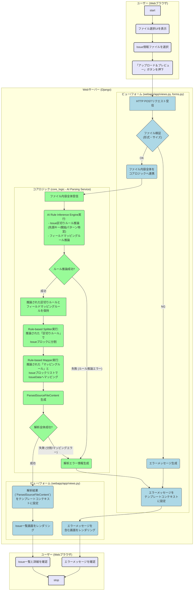

はい、承知いたしました。
`US-001: Web UIでのIssueファイルのアップロード、AIによる区切り・マッピングルール推論と解析、一覧表示` のアクティビティ図をMermaid形式で出力します。

**図の補足:**

* コアロジック内の処理を「AI Rule Inference Engine実行」→「ルール推論成功?」→「推論されたルールを保持」→「Rule-based Splitter実行 (分割)」→「Rule-based Mapper実行 (マッピング)」→「ParsedSourceFileContent 生成」という、より詳細なステップに分解。
* 初期パーサーがファイル全体を受け取るように変更（B3からD1への連携）。
* AIによるルール推論の失敗と、その後の分割/マッピング処理の失敗を区別できるように分岐を追加。
* AIパーサーの新しい役割と、それに伴う処理フローが明確に反映されています。
