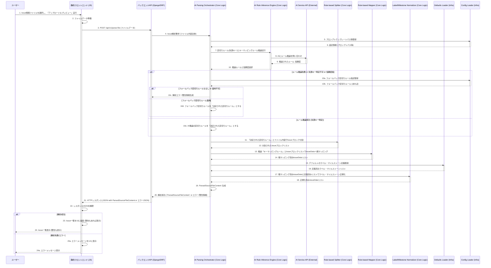

# US-001: Web UIでのIssueファイルのアップロード、AIによる区切り・キーマッピングルール推論と解析、一覧表示 - シーケンス図

このドキュメントは、ユーザーストーリー US-001 の主要なコンポーネント間のインタラクションを時系列で図示します。

**シーケンス図の修正ポイント:**
* 参加者を「User」「静的フロントエンド (JS)」「バックエンドAPI (Django/DRF)」とし、その後のコアロジックコンポーネントはバックエンドAPI内部で呼び出される形としました。
* ユーザーの最初のインタラクションは静的フロントエンドに対して行われます。
* 静的フロントエンドとバックエンドAPI間の通信は、HTTPリクエスト（例: `POST /api/v1/parse-file`）とHTTPレスポンス（JSONデータ）で表現しました。
* バックエンドAPIがコアロジックの `AIParsingOrchestrator` を呼び出し、解析結果やエラー情報を受け取ります。
* 静的フロントエンドがAPIからのレスポンスを処理し、UIを更新してユーザーに結果を表示する流れを明確にしました。
* メッセージの番号を振り直しました。
