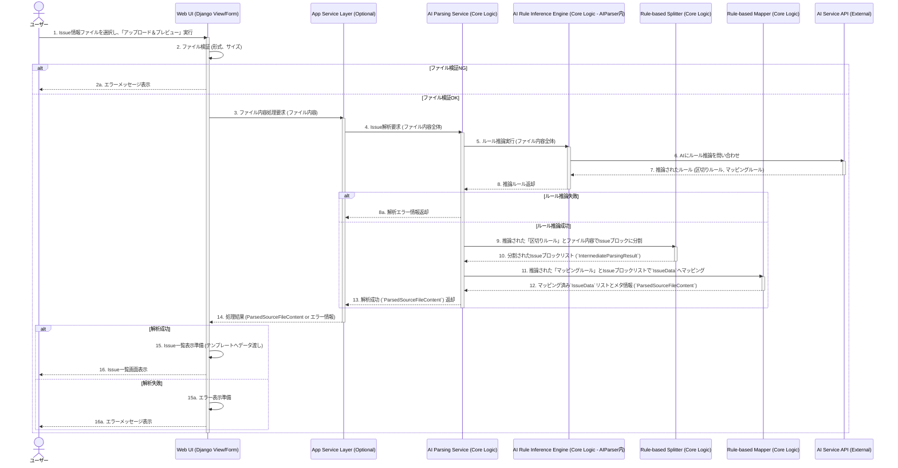

**シーケンス図案: US-001 Web UIでのIssueファイルのアップロード、AIによる区切り・マッピングルール推論と解析、一覧表示**

**シーケンス図の説明:**

1.  **ユーザー**がWeb UI上でファイルを選択し、アップロードアクションを実行します。
2.  **Web UI (Django View/Form)** は受け取ったファイルを検証します（形式、サイズ）。
    * 検証NGの場合、ユーザーにエラーメッセージを表示します。
3.  ファイル検証OKの場合、**Web UI** は（導入されていれば）**App Service Layer** にファイル内容の処理を要求します。
    * *サービス層がない場合は、Web UI が直接 AI Parsing Service を呼び出す形になります。*
4.  **App Service Layer** は、**AI Parsing Service**（コアロジック内の中核サービス）にIssue解析を要求し、ファイル内容全体を渡します。
5.  **AI Parsing Service** は、まず内部の **AI Rule Inference Engine** にファイル内容全体を渡し、区切りルールとフィールドマッピングルールの推論を実行させます。
6.  **AI Rule Inference Engine** は、設定されたAIモデル（OpenAI/Gemini）の**AI Service API** と通信し、ルールを推論します。
7.  **AI Service API** は推論結果（区切りルール、マッピングルール）を返します。
8.  **AI Rule Inference Engine** は推論されたルールを **AI Parsing Service** に返します。
    * ルール推論に失敗した場合、エラー情報が返されます。
9.  **AI Parsing Service** は、AIが推論した「区切りルール」とファイル内容を **Rule-based Splitter** に渡し、Issueブロックのリスト (`IntermediateParsingResult`) を生成させます。
10. **Rule-based Splitter** は分割結果を返します。
11. **AI Parsing Service** は、AIが推論した「フィールドマッピングルール」と、分割されたIssueブロックリストを **Rule-based Mapper** に渡し、各ブロックを `IssueData` オブジェクトに変換させ、最終的に `ParsedSourceFileContent` を生成します。
12. **Rule-based Mapper** は `ParsedSourceFileContent` を返します。
13. **AI Parsing Service** は、処理結果（成功なら `ParsedSourceFileContent`、失敗ならエラー情報）を **App Service Layer** に返します。
14. **App Service Layer** は、その結果を **Web UI (Django View)** に返します。
15. **Web UI** は、結果に応じてIssue一覧表示の準備、またはエラー表示の準備を行います。
16. **Web UI** は、最終的な画面を**ユーザー**に表示します。
